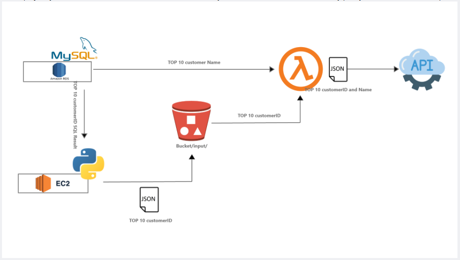
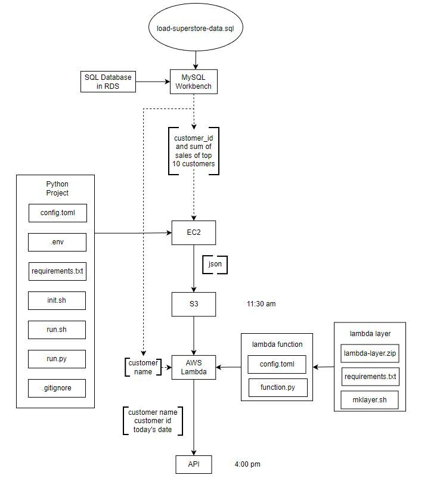

# 🧪 Top 10 Customers Data Pipeline with AWS (MySQL → S3 → Lambda → API)

This project was completed as part of the [WeCloudData Data Engineering Certificate Program](https://weclouddata.com/). It demonstrates how to build a cloud-based data processing pipeline using **AWS RDS, EC2, S3, Lambda**, and a **public API endpoint**.

<br/>

## 📌 Objective

Create a data pipeline that:

1. Queries the top 10 customers by sales from a MySQL database hosted on AWS RDS.
2. Stores the result as a `.json` file on an EC2 instance.
3. Uploads the file to an S3 bucket.
4. Triggers an AWS Lambda function upon upload, which:

   * Extracts customer IDs from the JSON.
   * Queries customer names from the MySQL DB.
   * Sends a combined payload (ID, name, date) to a public API.

<br/>

## 🧱 Architecture




---

## ⚙️ Tech Stack

* **AWS RDS (MySQL)** – Stores Superstore sales data
* **AWS EC2** – Hosts the Python project for query + processing
* **AWS S3** – Stores JSON files
* **AWS Lambda** – Processes and posts data
* **MySQL Workbench** – Local DB query interface
* **Python** – Used for scripting
* **Git & GitHub** – Version control

---

## 🔄 Project Workflow

### 🛠️ Step 1: Data Setup

* Create a RDS instance on AWS via the GUI
* Connect to the RDS instance with MySQL engine.
* Connect to RDS using MySQL Workbench.
* Load the provided `load-superstore-data.sql` into RDS to create the `superstore` database.

### 🐍 Step 2: EC2 + Python Script

* Launch an EC2 instance and install necessary packages.
* Clone this GitHub repo and configure:

  * `config.toml` for secrets
  * `.env` for credentials
* Python script (script/run.py) will:

  * Connect to RDS
  * Query top 10 customers by sales
  * Write result to local JSON (output/data.json)
  * Upload to S3 under `/input/`

### ⚡ Step 3: Lambda Function

* Create a Lambda function that:

  1. Is triggered by S3 file upload
  2. Reads customer IDs from JSON
  3. Queries RDS to fetch customer names
  4. Posts combined info (ID, name, date) as shown below to:
     `https://virtserver.swaggerhub.com/wcd_de_lab/top10/1.0.0/add`
     [!json_data_structure](./docs/json.jpg)

#### 📦 Lambda Layer

* Includes `requests`, `sqlalchemy` and other libraries.
* Configured using a shell script in `script/lambda_creation.sh`.

---

## 🧪 Sample API Payload (POST)

```json
[
  {
    "id": "AA-10315",
    "name": "John Smith",
    "date": "2025-06-24"
  },
  ...
]
```

A successful `POST` will return a `201 Created` status.

---

## 📁 Project Structure

```bash
DataEngineering_SuperStore_Data_ETL_Pipeline/
│
├── config.toml
├── .env
├── .gitignore
├── README.md
└── script/
    ├── .venv
    ├── .env
    ├── lambda_creation_local.sh
    ├── lambda_function_local.py
    ├── lambda_creation.sh
    ├── lambda_function.py
    ├── notification.json
    ├── run.sh
    ├── run.py
    ├── superstore.zip
    └── aws_utils/
        ├── __init__.py
        └── aws_utils.py
└── docs/
    └── projectCreation.md
└── logs/
    └── run.py.log
└── output/
    └── file.json
```

---

## 🚀 How to Run

3. Run `run.py` to create the JSON and upload to S3.
4. Lambda will automatically post the result to the API.

---

## ✅ Deliverables

* Top 10 customers queried and stored in S3
* Lambda-triggered API post with customer ID, name, and date
* Architecture diagram and README documentation

---

## 🧠 Lessons Learned

* How to set up RDS, EC2, S3, Lambda from scratch
* Managing secrets securely with `.env` and config files
* Working with Python libraries like `sqlalchemy`, `boto3`, and `requests`
* Structuring projects for modular and cloud-triggered pipelines

---

## 👩‍💻 Author

**Sanya Syed**
[LinkedIn](https://linkedin.com/sanyassyed) | [GitHub](https://github.com/sanyassyed)

---

